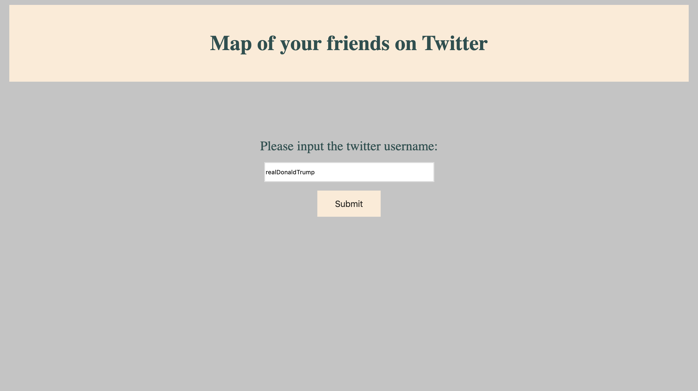
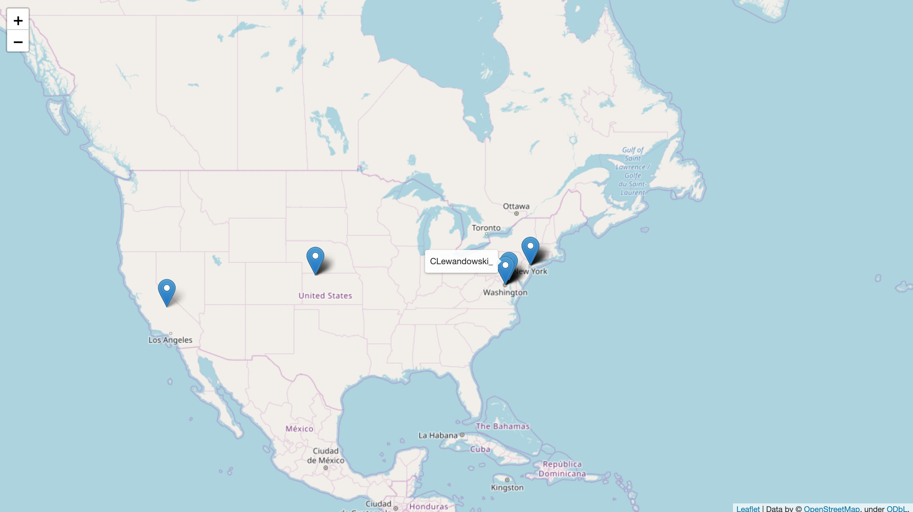

#Map of your friends
## About
This is a web application that generates a map of your twitter friends based on your username.
First page represented by ``index.html`` consists of the form for the username you are searching.
Ater the username has been submitted, the application generates a map that consists of the markers, representing one of the user's friends. 
Every marker shows the name of the friend on hover.
# Structure
This repository consists of ``json_parser.py``, which is the solution for lab's TASK 2, ``app.py``, which is the primary application for the lab's TASK 3 and ``twitter.py`` is auxiliary module for  ``app.py``
Directories ``/static`` and ``/templates`` include all of the CSS and HTML files respectively.
#Twitter data
This application uses only the public account information of Twitter users.
# Twitter API
This application requires a Twitter API to function. To activate the application you have to paste the corresponding keys into ``oauth.py`` function ``oauth()``
## Example of usage

